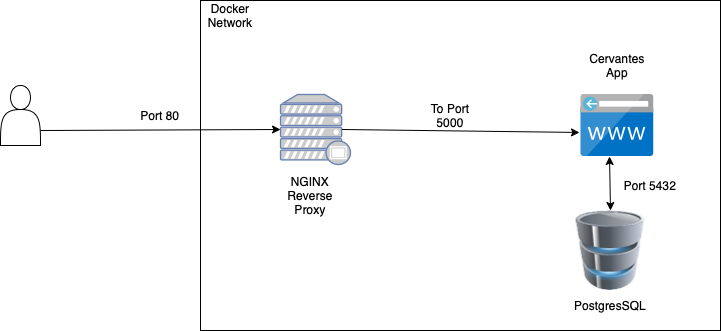
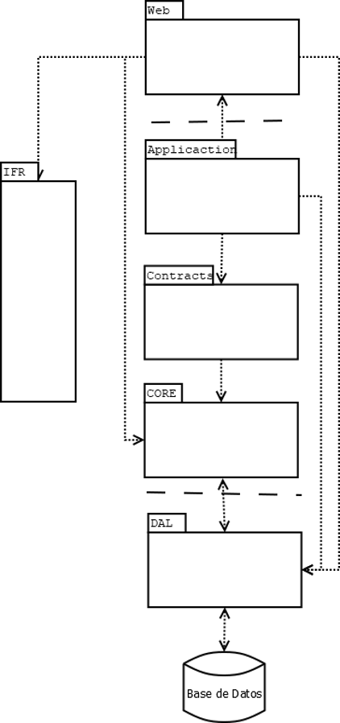

## {{page.title}}

### Docker Architecture

The Cervantes architecture is quite simple. We use and nginx as reverse proxy and the app is written in C# / .NET 6 hosted on Kestrel. 
The information is stored in a PostgreSQL server.

The port exposed externally is port 80 then the reverse proxy sent the request to cervantes app container where is the Kestrel listening on port 5000. The have access to database container on port 5432

Note: Ports 5000 and 5432 are only accessible by the containers

### Application Architecture

The chosen architecture has been an N-Tier architecture. This type of architecture will help us to offer a better design and in the future scale and maintain the platform in an easier way.

#### Web Layer

The web layer will be the presentation layer of the platform where we will find the web part that will be the visual part that the user will see.

#### Application Layer

The application layer will be where all the business logic will be found and will serve as an intermediary. 

#### CORE Layer

The CORE layer will be the layer that will contain all the classes and entities that will be part of the platform.

#### Contracts Layer

In the contracts layer we will find the interfaces that will provide the contract that will be used by the Manager inside the Application layer.

#### DAL layer

The DAL layer is in charge of accessing the data that will be stored in the database 

#### IFR layer

The IFR layer offers the general functionalities of the platform, i.e. these functions could be email functions or other generic functions that may be needed.

