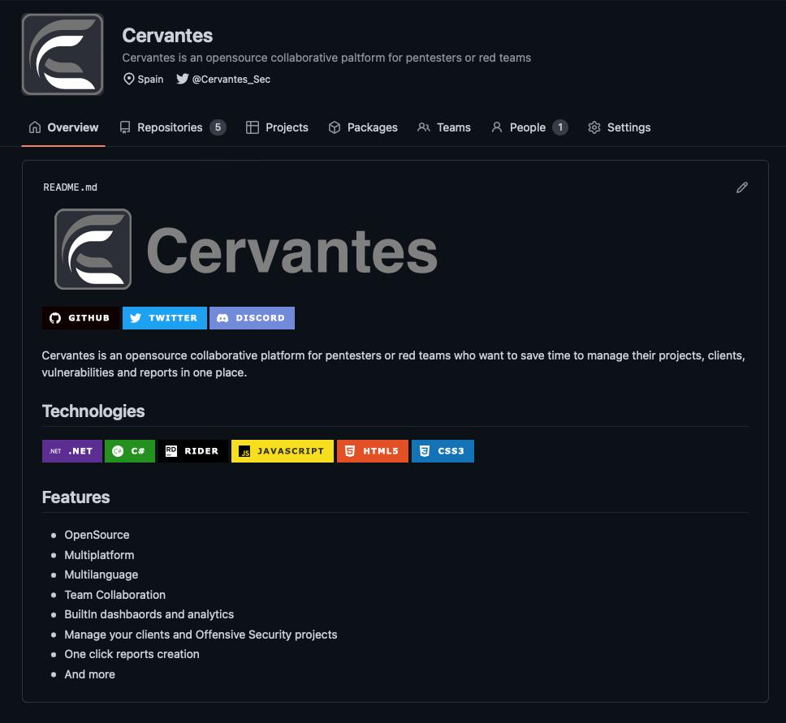

## Development

### Version control

All the code for Cervantes is open. Below are the most important links:

- [Github organisation](https://github.com/CervantesSec)

#### Repositories

- [Application](https://github.com/CervantesSec/cervantes) - Cervantes Application
- [Docker Install](https://github.com/CervantesSec/docker) - Cervantes Docker installation files
- [Documentation](https://github.com/CervantesSec/documentation) - This web

### Community

Find us on [Discord](https://discord.gg/BvzNjT3Qzc) where we can discuss any Cervantes related topic.