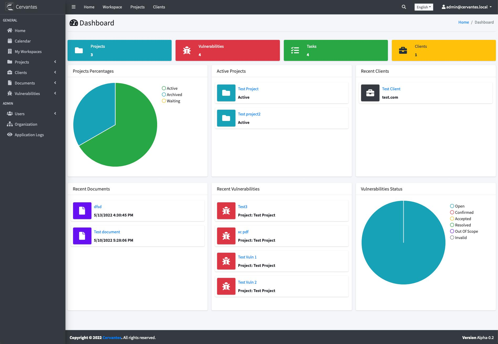
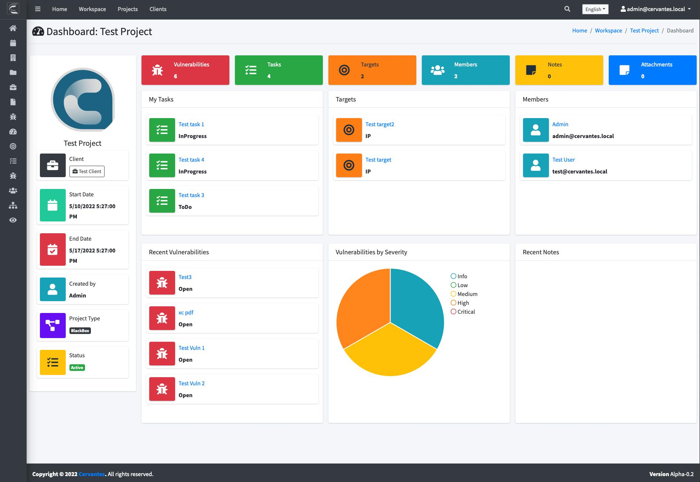

## {{page.title}}

### Home Dashboard

The home dashboard is what welcomes the user after logging in Cervantes. This dashboard present at a glance insight information about projects, vulnerabilities, clients

 

| Name                   | Description                                                       |
|:-----------------------|:------------------------------------------------------------------|
| Project                | Number of projects                                                |
| Vulnerabilities        | Number of vulnerabilities across all projects                     |
| Tasks                  | Number of tasks across all projects                               |
| Clients                | Number of clients                                                 |
| Projects Percentages   | Project grouped by status (active, archived, waiting)             |
| Active Projects        | Shows a list of teh active projects                               |
| Recent Clients         | Shows a list of recent clients                                    |
| Recent Documents       | Shows a list of recent documents                                  |
| Recent Vulnerabilities | Shows the most recently reported vulnerabilities                  |
| Vulnerabilities Status | Vulnerabilities grouped by status (open, confirmed, accepted,...) |

### Workspace Dashboard

The Workspace dashboard is what welcomes the user in a specific project. This dashboard present at a glance insight information about a specific project vulnerabilities, tasks, targets and more
*Note: This dashboard is only accessible by users enrolled in projects*

 

| Name                        | Description                                                      |
|:----------------------------|:-----------------------------------------------------------------|
| Vulnerabilities             | Number of vulnerabilities inside the project                     |
| Tasks                       | Number of tasks inside the project                               |
| Targets                     | Number of targets inside the project                             |
| Members                     | Number of members inside the project                             |
| Notes                       | Number of notes inside the project                               |
| Attachments                 | Number of attachments inside the project                         |
| My Tasks                    | Shows a list of tasks assigned to you                            |
| Targets                     | Shows a list of targets                                          |
| Members                     | Shows a list of members enrolled in the project                  |
| Recent Vulnerabilities      | Show a list of recent vulnerabilities                            |
| Vulnerabilities by severity | Vulnerabilities grouped by severity (critical, high, medium,...) |
| Recent Notes                | Show a list of recent notes                                      |
