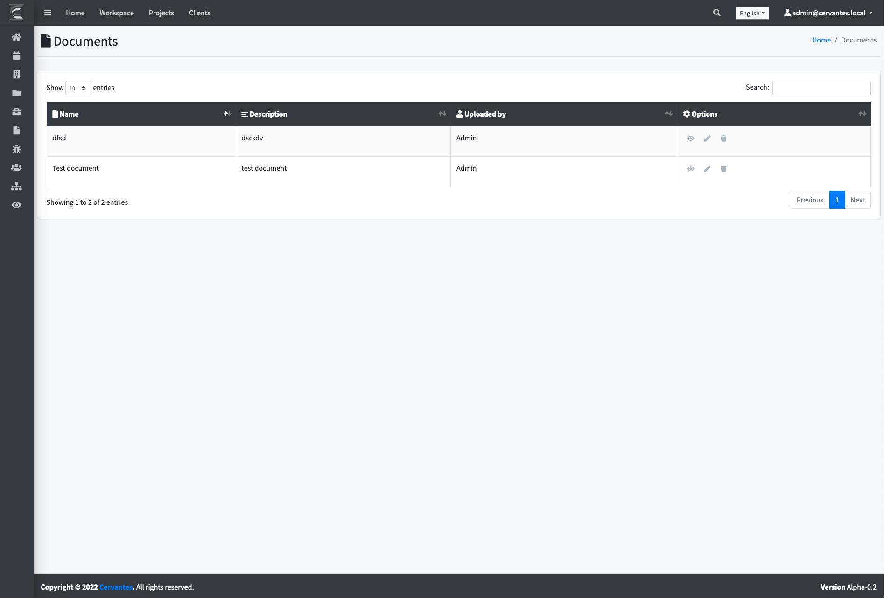
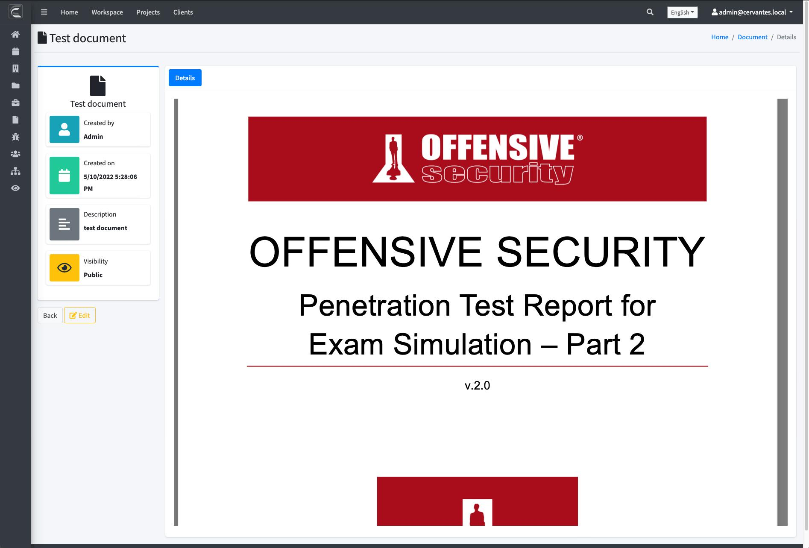

## {{page.title}}

The documents module allows the user to store documents (pdf,docx,...) to share with the team

Some common uses for the document library are storing NDA (Non-disclosure agreements),security questionnaires, methodologies and what you want

