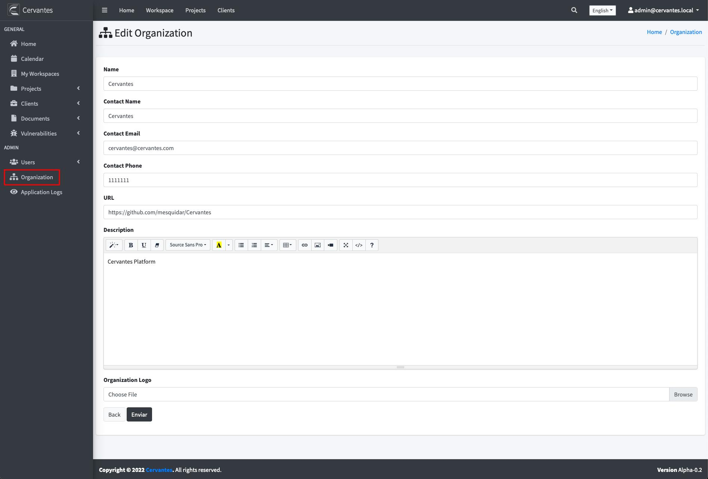

## {{page.title}}

An organization represents your company. The organization information is shown in the reports that you generate with Cervantes

Here is how you can update the organisation information:

*Note: You can only edit organization information if you have the admin role*

