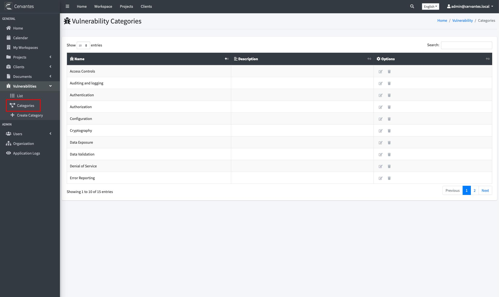
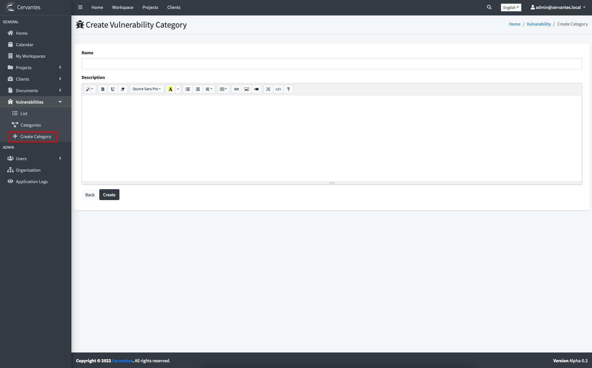

## {{page.title}}

In Cervantes all vulnerabilities are associated to one category

* Access Controls
* Auditing and Logging
* Authentication
* Configuration
* Cryptography
* Data Exposure
* Data Validation
* Denial of Service
* Error Reporting
* Injection
* Patching
* Session Management
* Timing

### Custom categories

If you are admin you can add, edit or remove any number of additional categories to the system using the **Vulnerability categories** page.

