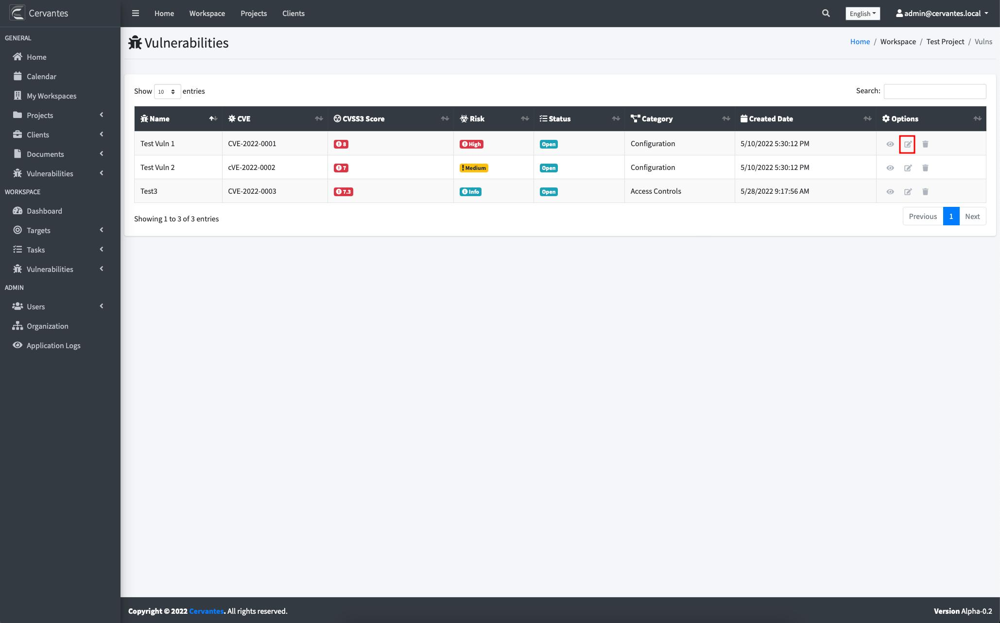
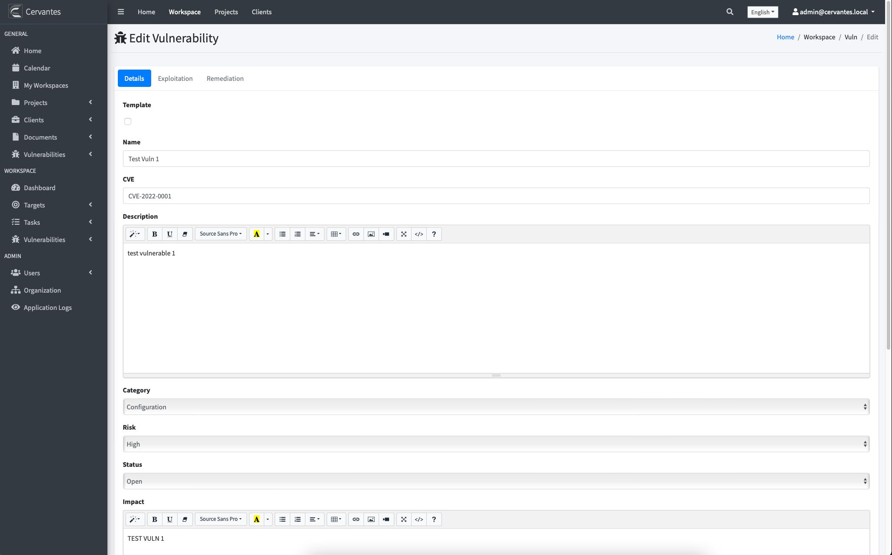

## {{page.title}}

In Cervantes you can edit vulnerabilities by clicking on the "pencil" icon on the vulnerability list

This will redirect you to a new view where you were able to edit the information

