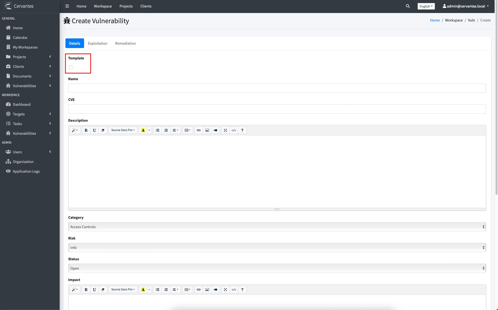
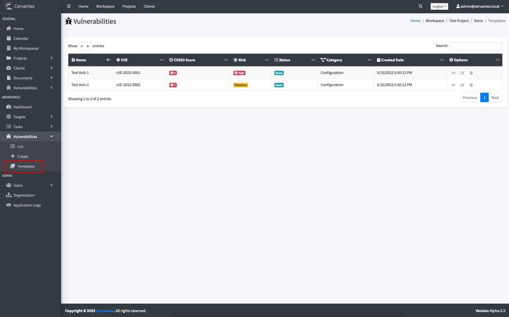

## {{page.title}}

In Cervantes you can use templates to create your vulnerabilities, to do that you have to create a normal vulnerability but checking the first checkbox

With the template created if you go to templates you can edit these vulnerabilities a create a new one from the selected vulnerability

