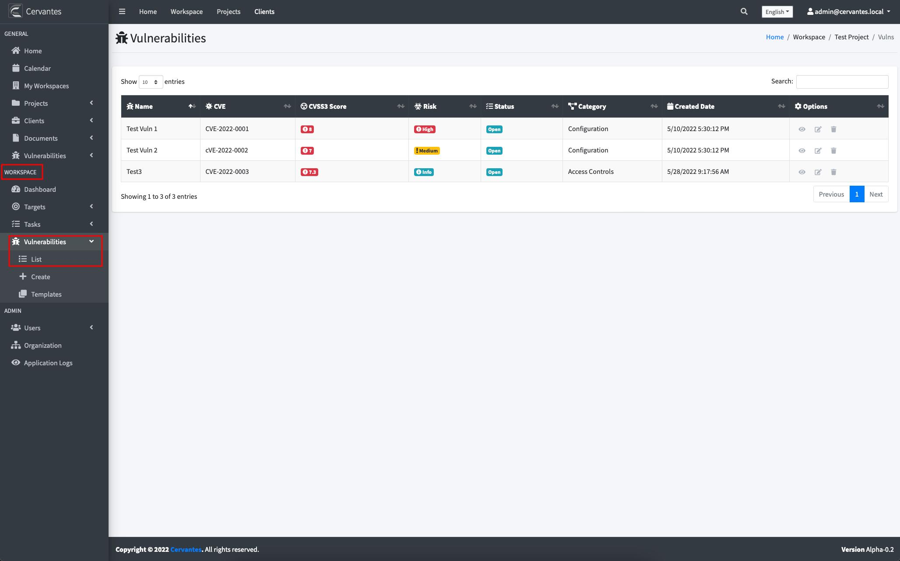

## {{page.title}}

The **vulnerabilities** view lists all the vulnerabilities that were reported by the users on Cervantes

The vulnerabilities list allows presents the following information:

From this view you can view more details about each vulnerability or delete them if they are no longer applicable.

### Workspace Vulnerability List

The workspace vulnerability view lists all the vulnerabilities that were reported in the project

From this view you can view more details about each vulnerability or delete them if they are no longer applicable.
